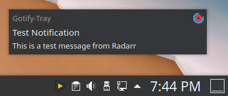
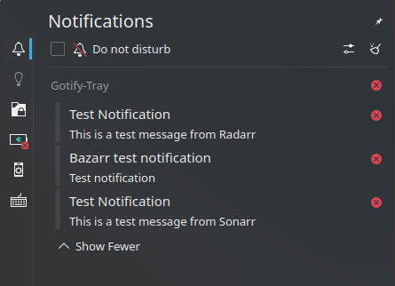

# Gotify Tray


A tray notification application for receiving messages from a [Gotify server](https://github.com/gotify/server).


<p align="center">
    <a href="https://github.com/gotify/logo">
        
    </a>
</p>

## Download


[Download the latest release.](https://github.com/seird/gotify-tray/releases/latest)


## Supported Platforms

See https://doc.qt.io/qt-6/qsystemtrayicon.html#details


## Manual Install

Get the source and install the requirements:

```
$ git clone https://github.com/seird/gotify-tray.git
$ cd gotify-tray
$ pip install -r requirements.txt
```

### Run from source

```
$ python entry_point.py
```

### Create a pyinstaller executable

```
$ pip install pyinstaller
$ pyinstaller gotify-tray.spec
```
An executable is created at `dist/gotify-tray/`.


### Create a deb package

```
$ make build

# or install

$ sudo make install
```

### (Inno setup (Windows))

Create an installer for windows with inno setup:

```
$ iscc gotify-tray.iss
```


## Images

Windows 10                                         |  KDE
:-------------------------------------------------:|:---------------------------------------------------------:
           |  
    |  


## Requirements

- python 3.9
- PyQt6
- requests
- websocket-client
